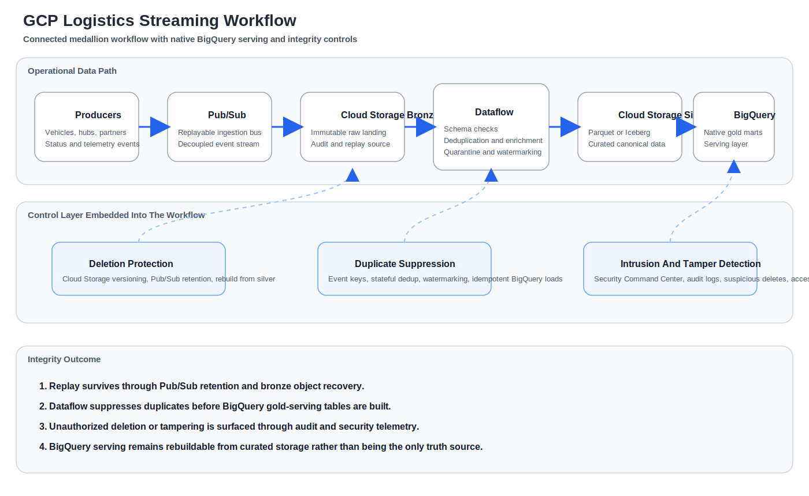

# GCP Architecture Workflow

The connected control lane makes the GCP-native path explicit: replay from `Pub/Sub`, delete recovery in `Cloud Storage`, deduplication in `Dataflow`, and audited serving in `BigQuery`.
